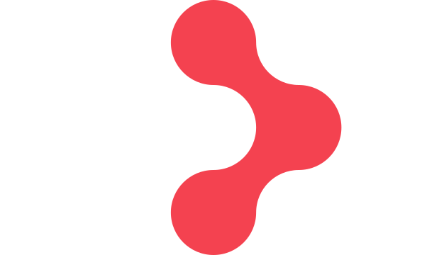

## Hi there 👋

Data Science/AI Engineer loves creating AI applications to automate tasks. Good at FastAPI, Python, Data Science. Will delve into different tech stacks just for the fun of learning and fine-tuning applications.

- 🔭 I’m currently working on AI Chatbot and Commerce Platform
- 🌱 I’m currently learning Typescript, MCP, DevOps, LLM Automation
- 💬 Ask me about food!. I love food!
- ⚡ Fun fact: I can drive reach in a freezer (-22°) for 3 hours.

## Tech Stacks

  
  
  
  
  
  
  
  
  
  
  
  
  
  
  
  
  
  
  
  
  
  
  
  
  
  
  
  
  
  
  
  
  
  
  
  
  
  
  
  
  
  

## Language Distribution

